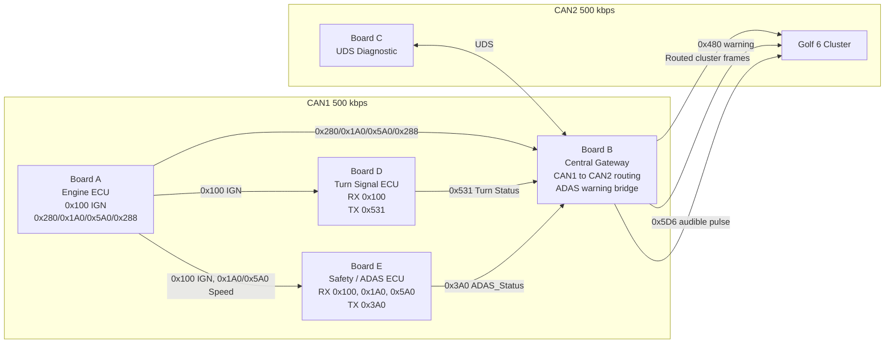

# CAN Gateway & UDS Diagnostic System

STM32F429ZI 기반 다중 ECU 교육용 프로젝트입니다. Board A가 차량 상태를 CAN1에 만들고, Board D와 Board E가 CAN1의 IGN/속도 정보를 참고해 각자 기능 프레임을 송신합니다. Board B는 Central Gateway로 CAN1 프레임을 CAN2 계기판/진단 버스로 라우팅하고, Board C는 UDS 진단 요청을 담당합니다.

현재 통신 기준은 최신 Board A 프로토콜입니다.

- Board A는 `0x100`을 IGN Status 전용으로 송신합니다.
- Board A는 RPM/Speed/Coolant 계기판 프레임을 `0x280`, `0x1A0`, `0x5A0`, `0x288`로 송신합니다.
- Board D는 CAN1에서 `0x100` IGN을 읽고, IGN ON일 때 `0x531` Turn Status를 송신합니다.
- Board E는 CAN1에서 `0x100` IGN과 `0x1A0`/`0x5A0` 속도를 읽고, Board B가 기대하는 `0x3A0 ADAS_Status`를 송신합니다.
- Board B는 CAN1 라우팅 테이블과 Safety Bridge로 CAN2 계기판 프레임 및 warning 프레임을 생성합니다.

## System Architecture

```text
CAN1 - Powertrain / Body / Safety bus, 500 kbps

  Board A Engine ECU
    TX 0x100 IGN Status
    TX 0x280 RPM
    TX 0x1A0 Speed raw
    TX 0x5A0 Speed needle
    TX 0x288 Coolant

  Board D Turn Signal ECU
    RX 0x100 IGN Status
    TX 0x531 Turn Status

  Board E Safety / ADAS ECU
    RX 0x100 IGN Status
    RX 0x1A0 / 0x5A0 Speed
    TX 0x3A0 ADAS_Status

  Board B Central Gateway
    RX CAN1 frames
    Route selected frames to CAN2
    Convert ADAS risk/fault to 0x480 warning and 0x5D6 audible pulse

CAN2 - Cluster / Diagnostic bus, 500 kbps

  Volkswagen Golf 6 Cluster
    RX routed cluster frames
    RX 0x480 warning frame
    RX 0x5D6 audible warning pulse

  Board C UDS Diagnostic
    UDS request / response with Board B
```



## Board Roles

| Board | Role | CAN port | Main behavior |
|---|---|---|---|
| Board A | Engine ECU simulator | CAN1 | Sends IGN, RPM, speed, coolant frames |
| Board B | Central Gateway | CAN1 + CAN2 | Routes CAN1 frames to CAN2 and converts ADAS warning state |
| Board C | UDS Diagnostic board | CAN bus used with gateway diagnostic side | Sends diagnostic requests and receives responses |
| Board D | Turn Signal ECU | CAN1 | Reads IGN from CAN, sends `0x531` turn signal frame |
| Board E | Safety / ADAS ECU | CAN1 | Reads IGN and speed from CAN, sends `0x3A0 ADAS_Status` |
| Cluster | Volkswagen Golf 6 cluster | CAN2 | Displays routed cluster and warning frames |

## CAN Message Summary

### CAN1 Internal / Source Frames

| CAN ID | DLC | Sender | Receiver | Period | Purpose |
|---:|---:|---|---|---:|---|
| `0x100` | 8 | Board A | Board D, Board E, Board B | 50 ms | IGN Status. `byte[5] bit0 = IGN ON` |
| `0x280` | 8 | Board A | Board B | 50 ms | RPM cluster frame |
| `0x1A0` | 8 | Board A | Board B, Board E | 50 ms | Speed raw frame |
| `0x5A0` | 8 | Board A | Board B, Board E | 50 ms | Speed needle frame |
| `0x288` | 8 | Board A | Board B | 100 ms | Coolant cluster frame |
| `0x531` | 8 | Board D | Board B | 100 ms | Turn Status |
| `0x3A0` | 8 | Board E | Board B | 100 ms | ADAS_Status |

### CAN2 Routed / Cluster Frames

| CAN ID | DLC | Sender | Receiver | Purpose |
|---:|---:|---|---|---|
| `0x280` | 8 | Board B | Cluster | Routed RPM |
| `0x1A0` | 8 | Board B | Cluster | Routed speed |
| `0x5A0` | 8 | Board B | Cluster | Routed speed needle |
| `0x288` | 8 | Board B | Cluster | Routed coolant |
| `0x531` | 8 | Board B | Cluster | Routed turn signal status |
| `0x480` | 8 | Board B | Cluster | Golf 6 `mMotor_5` warning overlay from ADAS risk/fault |
| `0x5D6` | 8 | Board B | Cluster | Parking Assist audible warning pulse while ADAS risk >= 2 |

Board B does not forward Board E's raw `0x3A0` to CAN2 by default, because Golf 6 K-Matrix also uses `0x3A0` for another brake-related message. Instead, Board B converts ADAS warning/fault state to `0x480` (warning lights) and `0x5D6` (audible warning) when risk is 2 or higher.

## Payload Layouts

### Board A `0x100` IGN Status

| Byte | Meaning |
|---:|---|
| `byte[0..4]` | Reserved, 0 |
| `byte[5] bit0` | IGN ON |
| `byte[5] bit1..7` | Reserved |
| `byte[6..7]` | Reserved |

### Board A `0x1A0` Speed

| Byte | Meaning |
|---:|---|
| `byte[0]` | Fixed `0x08` |
| `byte[2..3]` | little-endian speed raw, `km/h * 80` |

### Board A `0x5A0` Speed Needle

| Byte | Meaning |
|---:|---|
| `byte[2]` | speed km/h value used for the needle/reference |

### Board D `0x531` Turn Status

| Byte / Bit | Meaning |
|---|---|
| `byte[2] bit0` | Left turn blink ON |
| `byte[2] bit1` | Right turn blink ON |
| `byte[2] bit2` | Hazard ON when left and right blink together |
| other bits | 0 |

### Board E `0x3A0` ADAS_Status

| Byte | Meaning |
|---:|---|
| `byte[0]` | flags: bit0 front collision, bit3 rear obstacle, bit4 sensor fault, bit5 active |
| `byte[1]` | risk level: 0 none, 1 info, 2 warning, 3 danger |
| `byte[2]` | front distance cm |
| `byte[3]` | rear distance cm |
| `byte[4]` | active fault bitmap |
| `byte[5]` | vehicle speed km/h |
| `byte[6]` | input bitmap |
| `byte[7]` | alive counter |

## Integration Checks

1. Power Board A and verify CAN1 has `0x100`, `0x280`, `0x1A0`, `0x5A0`, and `0x288`.
2. Power Board D and verify it receives CAN1 `0x100 byte[5] bit0 = 1`.
3. Press D left/right turn input and verify CAN1 `0x531 byte[2] bit0/bit1` blinks every 500 ms.
4. Power Board E and verify it receives CAN1 `0x100` plus `0x1A0` or `0x5A0`.
5. Verify Board E sends CAN1 `0x3A0` every 100 ms.
6. Power Board B and verify CAN2 sees routed `0x280`, `0x1A0`, `0x5A0`, `0x288`, and `0x531`.
7. Trigger Board E warning conditions and verify Board B sends CAN2 `0x480` plus pulsed `0x050` when risk is 2 or higher.

## Directory Layout

```text
can-gateway-uds/
├── common/                 # Shared CAN/UART/CLI/protocol definitions
├── docs/                   # DBC and project documentation
├── firmware/
│   ├── board_a_engine/     # Engine ECU simulator
│   ├── board_b_gateway/    # Central Gateway
│   ├── board_c_uds/        # UDS diagnostic board
│   ├── board_d_body/       # Turn Signal ECU
│   └── board_e_safety/     # Safety / ADAS ECU
├── tests/
└── tools/
```

## Build

From each board directory:

```bash
cmake --preset Debug --fresh
cmake --build --preset Debug --parallel
```

Example:

```bash
cd firmware/board_d_body
cmake --preset Debug --fresh
cmake --build --preset Debug --parallel
```

Root integration build:

```bash
cmake --preset Debug --fresh
cmake --build --preset Debug --parallel
```

## References

- [Project CAN DB](docs/can_db.md)
- [Architecture](docs/architecture.md)
- [Interface Spec](docs/interface_spec.md)
- [UDS DID Map](docs/uds_did_map.md)
- [Golf 6 PQ35 DBC](docs/Golf_6_PQ35.dbc)

## License

Educational use only.
