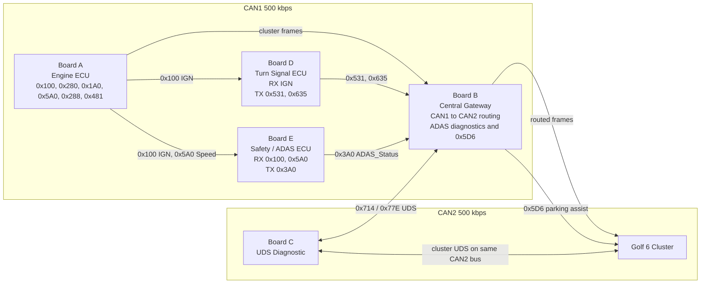

# CAN Gateway & UDS Diagnostic System

STM32F429ZI 기반 다중 ECU 교육용 프로젝트입니다. 현재 구현은 Board A, D, E, B가 CAN1 차량 내부 버스를 공유하고, Board B가 선택된 CAN1 프레임을 CAN2 계기판/진단 버스로 전달하는 구조입니다. Board C는 UDS 진단 클라이언트이며, 보드의 CAN1 주변장치를 물리적으로 Board B의 CAN2 진단 버스에 연결해서 사용합니다.

## 현재 구현 기준

- Board A는 `0x100`을 IGN Status 전용 프레임으로 50 ms마다 송신합니다. 현재 payload는 항상 `byte[5] bit0 = 1`입니다.
- Board A는 계기판 반응용 `0x280`, `0x1A0`, `0x5A0`, `0x288`과 엔진 경고 상태 `0x481`을 송신합니다.
- `0x1A0`은 현재 zero-filled keepalive입니다. 속도 기준값은 `0x5A0 byte[2]`에 `km/h / 2` 형태로 들어가며, Board B와 Board E는 이를 다시 `* 2`로 해석합니다.
- Board D는 CAN1에서 `0x100`, 선택적으로 Golf6 호환 `0x570`/`0x572`를 읽어 IGN을 판단하고, IGN ON일 때 `0x531` 방향지시등과 `0x635` 계기판 밝기 프레임을 송신합니다.
- Board E는 CAN1에서 `0x100` IGN과 `0x5A0` 속도를 읽고, ADAS 판단 결과를 `0x3A0 ADAS_Status`로 송신합니다. 오래된 non-zero `0x1A0` 속도 프레임도 호환 목적으로 받을 수 있습니다.
- Board B는 라우팅 테이블에 등록된 CAN1 프레임만 CAN2로 포워딩합니다. Board E의 원본 `0x3A0`은 기본적으로 CAN2로 포워딩하지 않습니다.
- Board B Safety Bridge는 `0x3A0`을 진단 상태/DTC로 저장하고, `risk_level >= 2`일 때 CAN2 `0x5D6` 파킹 어시스트 프레임을 스윕 송신합니다. 현재 코드 기준으로 ADAS를 `0x480` 또는 `0x050`으로 변환 송신하지 않습니다.
- Board B는 CAN2 `0x714` 요청에 대해 Gateway ADAS DID(`0xF410`-`0xF413`)와 Clear DTC(`0x14`)만 Single Frame으로 응답합니다. Board C는 같은 ID로 계기판 UDS 요청도 보낼 수 있습니다.

## System Architecture

```text
CAN1 - Powertrain / Body / Safety bus, 500 kbps

  Board A Engine ECU
    TX 0x100 IGN Status
    TX 0x280 RPM
    TX 0x1A0 Speed keepalive
    TX 0x5A0 Speed needle/reference
    TX 0x288 Coolant
    TX 0x481 Engine warning status

  Board D Turn Signal ECU
    RX 0x100, optional 0x570/0x572 IGN fallback
    TX 0x531 Turn Status
    TX 0x635 Cluster Brightness

  Board E Safety / ADAS ECU
    RX 0x100 IGN Status
    RX 0x5A0 Speed reference
    TX 0x3A0 ADAS_Status

  Board B Central Gateway
    RX CAN1 frames
    Route selected frames to CAN2
    Store ADAS diagnostic state
    Generate 0x5D6 parking-assist sweep when ADAS risk >= 2

CAN2 - Cluster / Diagnostic bus, 500 kbps

  Volkswagen Golf 6 Cluster
    RX routed cluster frames
    RX 0x5D6 parking-assist frames

  Board C UDS Diagnostic
    TX 0x714 UDS request
    RX 0x77E UDS response
```



## Board Roles

| Board | Role | CAN 연결 | Main behavior |
|---|---|---|---|
| Board A | Engine ECU simulator | CAN1 | IGN, RPM, speed reference, coolant, engine warning 송신 |
| Board B | Central Gateway | CAN1 + CAN2 | CAN1 선택 프레임 포워딩, ADAS 진단 상태 저장, `0x5D6` 생성, Gateway ADAS UDS 응답 |
| Board C | UDS Diagnostic client | 보드 CAN1을 물리적으로 CAN2 버스에 연결 | `0x714` 요청 송신, `0x77E` 응답 수신 |
| Board D | Turn Signal ECU | CAN1 | IGN 수신, `0x531` 방향지시등, `0x635` 밝기 송신 |
| Board E | Safety / ADAS ECU | CAN1 | IGN/속도 수신, 초음파 거리 기반 `0x3A0 ADAS_Status` 송신 |
| Cluster | Volkswagen Golf 6 cluster | CAN2 | 라우팅된 계기판 프레임과 진단/파킹 어시스트 프레임 수신 |

## CAN Message Summary

### CAN1 Source Frames

| CAN ID | DLC | Sender | Receiver | Period | Purpose |
|---:|---:|---|---|---:|---|
| `0x100` | 8 | Board A | Board D, Board E, Board B | 50 ms | IGN Status. `byte[5] bit0 = IGN ON` |
| `0x280` | 8 | Board A | Board B | 50 ms | RPM. `byte[2..3] = rpm * 4`, little-endian |
| `0x1A0` | 8 | Board A | Board B, Board E | 50 ms | 현재 zero-filled speed keepalive |
| `0x5A0` | 8 | Board A | Board B, Board E | 50 ms | Speed reference. `byte[2] = km/h / 2` |
| `0x288` | 8 | Board A | Board B | 100 ms | Coolant. `byte[1] = ((degC + 48) * 4) / 3` |
| `0x481` | 8 | Board A | Board B | 100 ms | Engine warning status |
| `0x531` | 8 | Board D | Board B | 100 ms | Turn Status |
| `0x635` | 8 | Board D | Board B | fade 20 ms, hold 100 ms | Cluster brightness |
| `0x3A0` | 8 | Board E | Board B | 100 ms | ADAS_Status, CAN1 내부 프레임 |

### CAN2 Routed / Generated Frames

| CAN ID | DLC | Sender | Receiver | Purpose |
|---:|---:|---|---|---|
| `0x100` | 8 | Board B | Cluster/CAN2 bus | Routed IGN status |
| `0x280` | 8 | Board B | Cluster | Routed RPM |
| `0x1A0` | 8 | Board B | Cluster | Routed speed keepalive |
| `0x5A0` | 8 | Board B | Cluster | Routed speed reference |
| `0x288` | 8 | Board B | Cluster | Routed coolant |
| `0x481` | 8 | Board B | Cluster/CAN2 bus | Routed engine warning status |
| `0x531` | 8 | Board B | Cluster | Routed turn signal status |
| `0x635` | 8 | Board B | Cluster | Routed cluster brightness |
| `0x390` | 8 | Board B | Cluster/CAN2 bus | Legacy body-status route only. 현재 Board D는 송신하지 않음 |
| `0x5D6` | 8 | Board B | Cluster | Parking Assist sweep while ADAS risk >= 2 |
| `0x714` | 8 | Board C | Gateway/Cluster | UDS request |
| `0x77E` | 8 | Gateway/Cluster | Board C | UDS response |

## Payload Layouts

### Board A `0x100` IGN Status

| Byte | Meaning |
|---:|---|
| `byte[0..4]` | Reserved, 0 |
| `byte[5] bit0` | IGN ON |
| `byte[6..7]` | Reserved, 0 |

### Board A `0x5A0` Speed Reference

| Byte / Bit | Meaning |
|---|---|
| `byte[2]` | `km/h / 2` 값. 수신 측은 `* 2`로 해석 |
| `byte[4] bit4..5` | 엔진 경고 rising edge 후 1초 동안 `0x30` 설정 |

### Board A `0x481` Engine Warning Status

| Byte / Bit | Meaning |
|---|---|
| `byte[0] bit0` | RPM warning, `rpm >= 5000` |
| `byte[0] bit1` | Coolant warning, `coolant >= 115` |
| `byte[0] bit2` | General warning |
| `byte[1]` | Coolant value |
| `byte[2..3]` | RPM value, little-endian |
| `byte[7]` | Alive counter |

### Board D `0x531` Turn Status

| Byte / Bit | Meaning |
|---|---|
| `byte[2] bit0` | Left turn blink ON |
| `byte[2] bit1` | Right turn blink ON |
| `byte[2] bit2` | Hazard ON when left and right blink together |

### Board D `0x635` Cluster Brightness

| Byte | Meaning |
|---:|---|
| `byte[0]` | Brightness level `0x00` to `0x64` |
| `byte[1..7]` | 0 |

### Board E `0x3A0` ADAS_Status

| Byte | Meaning |
|---:|---|
| `byte[0]` | flags: bit0 front collision, bit3 rear obstacle, bit4 sensor fault, bit5 active |
| `byte[1]` | risk level: 0 none, 1 info, 2 warning, 3 danger |
| `byte[2]` | front distance cm |
| `byte[3]` | rear distance cm |
| `byte[4]` | active fault bitmap |
| `byte[5]` | vehicle speed km/h |
| `byte[6]` | input bitmap |
| `byte[7]` | alive counter |

## Integration Checks

1. Board A 전원 인가 후 CAN1에서 `0x100`, `0x280`, `0x1A0`, `0x5A0`, `0x288`, `0x481`을 확인합니다.
2. Board D가 CAN1 `0x100 byte[5] bit0 = 1`을 받고 `body status`에서 IGN ON으로 보이는지 확인합니다.
3. Board D 좌/우/비상 입력을 누르고 CAN1 `0x531 byte[2] bit0/bit1/bit2`가 500 ms blink phase로 변하는지 확인합니다.
4. Board D IGN ON edge에서 CAN1 `0x635 byte[0]`이 `0x00`에서 `0x64`까지 증가한 뒤 100 ms 주기로 유지되는지 확인합니다.
5. Board E가 CAN1 `0x100`과 `0x5A0`을 받고 `0x3A0`을 100 ms마다 송신하는지 확인합니다.
6. Board B가 CAN2로 `0x100`, `0x280`, `0x1A0`, `0x5A0`, `0x288`, `0x481`, `0x531`, `0x635`를 포워딩하는지 확인합니다.
7. Board E 위험 조건을 만들고 Board B가 CAN2 `0x5D6`을 송신하며, `read adas`, `read fault`, `clear dtc`에 응답하는지 확인합니다.

## Directory Layout

```text
can-gateway-uds/
├── common/                 # Shared CAN/UART/CLI/protocol definitions
├── docs/                   # DBC and project documentation
├── firmware/
│   ├── board_a_engine/     # Engine ECU simulator
│   ├── board_b_gateway/    # Central Gateway
│   ├── board_c_uds/        # UDS diagnostic client
│   ├── board_d_body/       # Turn Signal ECU
│   └── board_e_safety/     # Safety / ADAS ECU
├── tests/
└── tools/
```

## Build

각 보드 폴더에서 단위 빌드:

```bash
cmake --preset Debug --fresh
cmake --build --preset Debug --parallel
```

예시:

```bash
cd firmware/board_d_body
cmake --preset Debug --fresh
cmake --build --preset Debug --parallel
```

루트 통합 빌드:

```bash
cmake --preset Debug --fresh
cmake --build --preset Debug --parallel
```

루트 빌드는 `build_firmware` 타깃으로 Board A부터 Board E까지 configure/build합니다.

## References

- [Project CAN DB](docs/can_db.md)
- [Architecture](docs/architecture.md)
- [Interface Spec](docs/interface_spec.md)
- [UDS DID Map](docs/uds_did_map.md)
- [Golf 6 PQ35 DBC](docs/Golf_6_PQ35.dbc)

## License

Educational use only.
